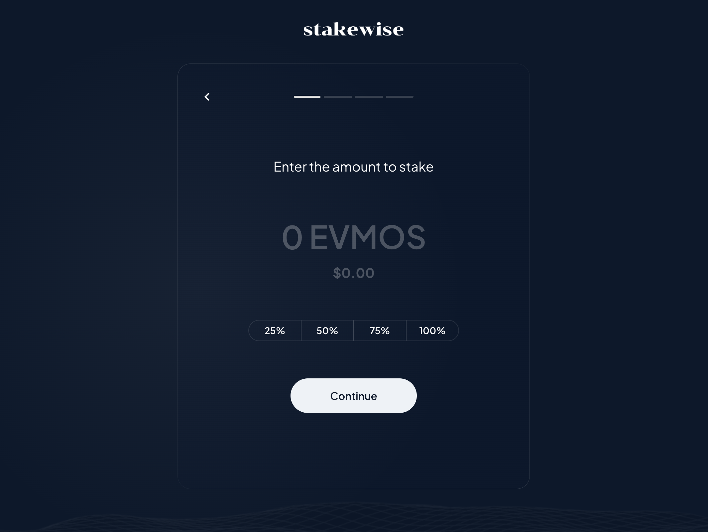

# StakeWise

This project was designed and built specifically for the [EVM Extensions Hackathon](https://dorahacks.io/hackathon/EVM/detail) hosted by the EVMOS Team and Dorahacks.

Deployed `MultiStaker.sol` contract on EVMOS Testnet: [0x02a85c9e6d859eafac44c3c7dd52bbe787e54d0a](https://testnet.escan.live/address/0x02a85c9e6d859eafac44c3c7dd52bbe787e54d0a)

Learn more about the `MultiStaker` contract that powered the platform [here](/contracts/README.md)

## Overview

StakeWise is a practical tool that facilitates seamless staking operations on the EVMOS network. The platform consists of two core components: the `MultiStaker` smart contract and the `tEVMOS Delegator Application`. These tools work in tandem to allow users to easily delegate their tokens across multiple validators according to their preferences.

## Utilizing EVM Extensions

The StakeWise platform extensively utilizes stateful EVM extensions, allowing the platform to perform cross-chain transactions and interact with core functionalities on the Evmos chain. These extensions behave like smart contracts within the EVM, enabling smart contracts to communicate with and leverage the core protocol's functionalities, such as staking and voting operations.

## What It Does

StakeWise offers a streamlined approach to token staking on the EVMOS network. By making the process of staking tokens, managing delegations, and withdrawing rewards straightforward and intuitive, StakeWise can serve as a beneficial tool for both novice and experienced stakeholders. 

## Features

StakeWise provides a wealth of features to ensure a comprehensive and user-friendly experience:

- **Flexible Staking**: StakeWise allows users to balance their stake across multiple validators, reducing the risk of staking on a single validator and potentially increasing staking rewards.

- **Dynamic Validator Selection**: StakeWise offers users the flexibility to select validators based on a range of criteria including their commission rates, the number of tokens they hold, and their jail status. 

- **Approve Methods for Delegation and Withdrawal of Staking Rewards**: Users can approve certain methods necessary for delegating tokens to validators and withdrawing earned rewards.

- **Manage Stakes**: StakeWise provides the functionality to redelegate tokens from one validator to another, cancel unbonding delegation, and unstake tokens, allowing users to adapt their staking strategy as needed.

- **Fetch and Display Validator Data**: StakeWise fetches and displays relevant data about validators and the user's delegations. 

## Tech Stack

The StakeWise platform comprises two main components: 

1. **MultiStaker:** A smart contract built on the Solidity language for the EVMOS network. It provides a comprehensive toolkit for managing stake-related transactions.

2. **tEVMOS Delegator Application:** A front-end application that provides an intuitive interface for managing delegations on the EVMOS Testnet, built with: React, Chakra UI, RainbowKit, Wagmi Hooks, Ethers.js, Next.js, and Vercel.

## How It Operates

At a high level, StakeWise operates by interfacing with the EVMOS network via the MultiStaker smart contract, which uses EVM extensions to interact with the core protocol functionalities. The contract manages approvals for various transactions, handles the distribution of rewards, and provides the user with view functions to check various pieces of data related to their stakes.

The tEVMOS Delegator Application provides a front-end interface where users can manage their tokens, select validators, and delegate their tokens. It interacts with the MultiStaker contract and EVM extensions to facilitate these operations and fetch relevant data.

The integration of these two components makes StakeWise a comprehensive tool for managing staking operations on the EVMOS network, while fully leveraging the power and flexibility of EVM extensions.

